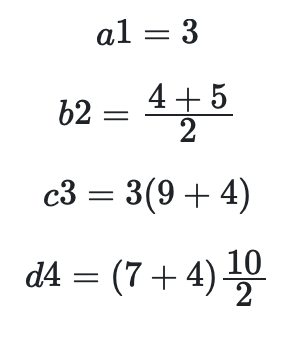

# Variables

Congratulations on completing the last exercise! You can now throw away your calculator and use Python instead!

Python is just not a replacement for your calculator, however.  We can use it to do so much more if we just learn a few ideas from computer science.  The first of these ideas is the notion of a variable.  One of the main reasons computers are better than calculators is that computers can remember things.  Computers have a memory.  Variables are the mechanism we can use to exploit the computer's memory.  To see how memory works consider the code shown below:

```python
var = (5+4)*3
print( var )
```

If you copy and paste this to the cell on the right and run the code you should see that the number 27 is output.  27 is output because the first line sets the variable var equal to the output of the calculation `(5+4)*3` (i.e. 27).  The print command then outputs whatever value is stored in the variable called var.

When I test your code I can check if you have defined variables with specific names and if you have set these variables to the correct value.  To test if you have understood this idea of variables I would thus like you to write a code in the cell to the left that sets the variables on the left-hand sides of the equations given below as follows:   


